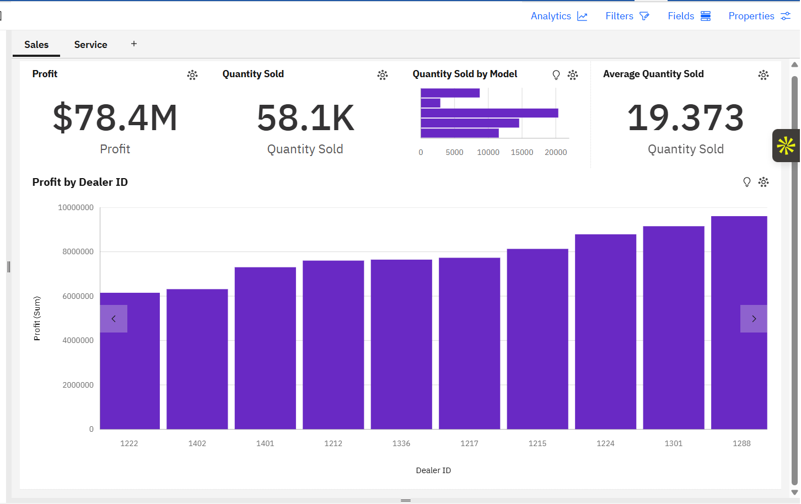
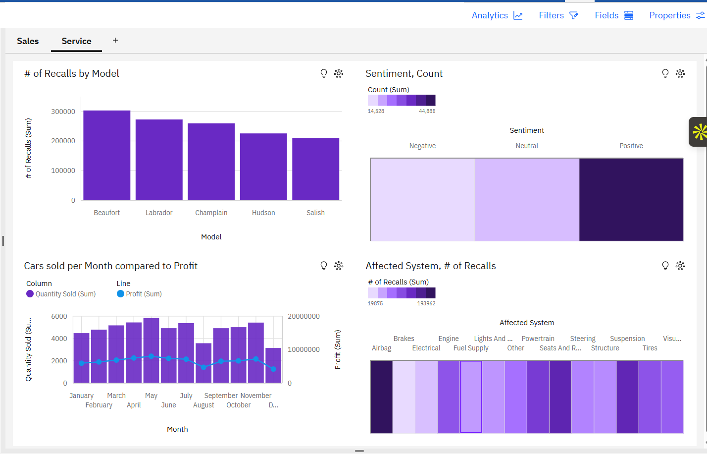

# 📊 Automotive Sales & Service Dashboard (IBM Cognos Analytics)

## 📌 Project Overview

This project uses IBM Cognos Analytics to analyze automotive dealership performance across both sales and service operations. The dashboard provides insights into profitability, sales performance, customer sentiment, and vehicle recalls.

The goal is to support data-driven decision-making for improving dealership efficiency and customer satisfaction.

---

## 📂 Data Source

This project uses a sample dataset provided by IBM as part of a Cognos Analytics learning exercise in the automotive domain.

---

## 🎯 Business Objective

The objective of this analysis is to evaluate:

- Sales performance across dealerships and car models  
- Profitability trends  
- Service quality indicators such as recalls and customer sentiment  
- Monthly sales and profit trends  

---

## 🛠 Tools Used

- IBM Cognos Analytics  
- Data Visualization  
- Dashboard Design  
- KPI Reporting  

---

## 📊 Dashboards Created

### 🚗 Sales Dashboard

Key metrics included:

- Total Profit  
- Quantity Sold  
- Quantity Sold by Model  
- Average Quantity Sold  
- Profit by Dealer ID  

### 🛠 Service Dashboard

Key metrics included:

- Recalls per car model  
- Customer sentiment analysis (positive, neutral, negative)  
- Monthly sales vs profit trends  
- Recall distribution by system and model  

---

## 📊 Dashboard Preview

### Sales Dashboard

### Service Dashboard

---

## 🔍 Key Insights

- Certain dealers contribute significantly higher profit than others  
- Specific car models show higher recall frequency  
- Customer sentiment varies across service categories  
- Sales and profit trends show seasonal variation  

---

## 💡 Business Recommendations

- Focus marketing on high-performing models and dealers  
- Investigate high-recall models for quality improvement  
- Improve customer service in low-sentiment segments  
- Optimize inventory based on monthly demand trends  

---

## 📄 Full Report

Download full dashboard report:

📎 [Sales Service IBM Cognos Dashboard PDF](Sales_Service_dashboard.pdf)

---

## 👤 Author

Nithish Sunkara   
LinkedIn: https://linkedin.com/in/nsunkara01